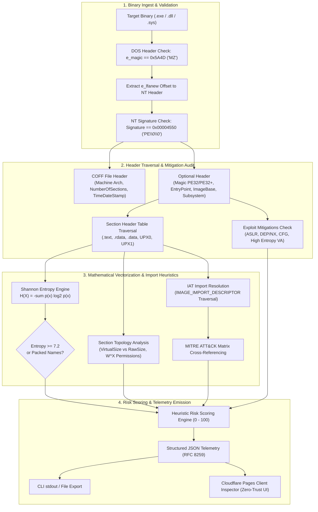

<div align="center">

# SENTINELSCAN

### Enterprise Systems Security & Static PE32/PE32+ Forensic Engine

*Autonomous Reverse Engineering, Shannon Entropy Vectorization, and Heuristic Import Profiling*

---

[](https://sentinelscan-app.pages.dev)
[](https://python.org)
[](https://learn.microsoft.com/en-us/windows/win32/debug/pe-format)
[](https://attack.mitre.org)
[](LICENSE)

</div>

---

## Executive Summary

**SentinelScan** is an executive-grade static binary analysis and reverse engineering platform designed to inspect Portable Executable (PE32/PE32+) binaries under a strict **zero-trust model**. It addresses modern evasion tradecraft where adversaries defeat signature-only defenses through polymorphic packers, crypters, and dynamic import resolution.

The platform provides dual operational interfaces:
1. **Cloudflare Pages Web Inspector (`sentinelscan-app`)**: A client-side, zero-trust browser application deployed at [https://sentinelscan-app.pages.dev](https://sentinelscan-app.pages.dev). Files are parsed entirely in-memory using JavaScript `ArrayBuffer` and `DataView` primitives—no executable bytes or binary streams are ever transmitted to a remote server.
2. **Python Forensic Core CLI (`sentinelscan_cli.py`)**: A dependency-free, headless command-line scanner built on Python 3.10+ standard libraries, emitting structured JSON telemetry for enterprise SIEM ingestion, automated CI/CD pipelines, and threat intelligence triage.

---

## The Concrete Threat Scenario: Why SHA-256 Hash Matching Fails

In contemporary enterprise threat landscapes, relying on cryptographic checksums (MD5, SHA-1, SHA-256) for malware triage introduces severe blind spots against modern adversaries.

```
┌────────────────────────────────────────────────────────────────────────┐
│                   TRADITIONAL HASH MATCHING FAILURES                   │
├────────────────────────────────────────────────────────────────────────┤
│ 1. Polymorphic Packing: UPX, Themida, Enigma, custom stubs           │
│    -> Appending 1 benign overlay byte mutates 100% of the SHA-256 hash │
│                                                                        │
│ 2. Dynamic API Resolution: Hiding Imports from Static Scanners         │
│    -> Malicious functions (VirtualAllocEx, WriteProcessMemory) do NOT   │
│       appear in the Import Address Table (IAT)                         │
│    -> Adversary calls LoadLibraryA("kernel32.dll") + GetProcAddress()  │
│       or parses PEB -> LDR_DATA_TABLE_ENTRY export tables in memory    │
│                                                                        │
│ 3. Memory Self-Modification (W^X Violations)                          │
│    -> Packed stub unpacks real malicious payload into RAM at runtime   │
└────────────────────────────────────────────────────────────────────────┘
```

### 1. Hash Brittleness Against Polymorphic Re-Packing
Cryptographic hash functions are deliberately engineered with the **avalanche effect**: flipping a single bit produces an uncorrelated, pseudorandom digest. Threat actors exploit this by:
- Recompiling or repacking the identical malicious payload with polymorphic packers (e.g., UPX, MPRESS, ASPack, or bespoke crypters).
- Appending ephemeral junk bytes to the binary overlay or unmapped section tail.
- Altering the PE timestamp (`TimeDateStamp` in the COFF header).

While the file hash changes entirely—rendering static hash blocklists (VirusTotal, IOC feeds) useless—the **structural section topology, byte entropy distribution, and underlying behavioral intent remain identifiably anomalous**.

### 2. Static Evasion via Dynamic API Resolution
Standard anti-malware scanners inspect the PE **Import Address Table (IAT)** to detect capabilities (e.g., process injection or network beacons). Advanced malware evades this by stripping imports:
- The binary imports only two baseline functions: `LoadLibraryA` (or `LoadLibraryW`) and `GetProcAddress`.
- At runtime, the loader dynamically loads target DLLs (`ntdll.dll`, `kernel32.dll`) and queries procedure addresses using obfuscated or hashed strings (e.g., ROR13 hashes).
- Advanced loaders bypass the IAT entirely by walking the Process Environment Block (`fs:[0x30]` on x86, `gs:[0x60]` on x64), traversing `PEB->Ldr->InMemoryOrderModuleList`, locating `kernel32.dll`, and indexing its Export Directory Table manually.

**SentinelScan bypasses these evasion strategies** by evaluating multi-vector heuristics: detecting dynamic resolution API clusters, flagging high Shannon entropy sections characteristic of packed code, identifying sections marked simultaneously Writable and Executable ($W \oplus X$ violations), and inspecting section virtual-to-raw size inflation.

---

## System Architecture

SentinelScan follows a modular forensic pipeline:



---

## MITRE ATT&CK Detection Matrix

SentinelScan correlates extracted IAT imports and section traits against critical MITRE ATT&CK techniques:

| MITRE ATT&CK Technique | ID | Win32 / Native API Cluster | Forensic Indicator / Behavior |
| :--- | :--- | :--- | :--- |
| **Process Hollowing / Injection** | `T1055` | `VirtualAllocEx` + `WriteProcessMemory` + `CreateRemoteThread`, `NtUnmapViewOfSection`, `SetThreadContext`, `ResumeThread` | Allocates unmapped remote process memory, unmaps legitimate code (hollowing), writes payload, and redirects thread execution context. |
| **Dynamic API Resolution** | `T1027.007` | `LoadLibraryA`, `LoadLibraryW`, `GetProcAddress`, `LdrLoadDll`, `LdrGetProcedureAddress` | Obfuscates static import visibility; dynamically resolves sensitive routines at runtime to defeat static IAT auditing. |
| **Input Capture (Keylogging)** | `T1056.001` | `SetWindowsHookExA`, `SetWindowsHookExW`, `GetAsyncKeyState`, `GetKeyState`, `GetKeyboardState` | Installs global Windows message hooks or polls hardware keyboard state to capture keystrokes and credentials. |
| **Virtualization & Sandbox Evasion** | `T1497` | `IsDebuggerPresent`, `CheckRemoteDebuggerPresent`, `NtQueryInformationProcess`, `OutputDebugStringA`, `QueryPerformanceCounter` | Checks for attached debuggers, hypervisors, and sandbox timing artifacts prior to payload execution. |
| **Persistence / Boot Execution** | `T1547` | `RegSetValueExA`, `RegSetValueExW`, `CreateServiceA`, `CreateServiceW`, `AdjustTokenPrivileges` | Registers Run keys in Windows Registry or provisions persistent Windows services for survival across reboots. |
| **Self-Modifying / Memory Violation** | `T1055` | Section Flags: `IMAGE_SCN_MEM_WRITE` $\land$ `IMAGE_SCN_MEM_EXECUTE` ($W \oplus X$ violation) | Section possesses both write and execute permissions simultaneously; typical of in-place unpackers and runtime decrypters. |
| **Software Packing** | `T1027.002` | Section Names: `UPX0`, `UPX1`, `.aspack`, `.mpress`, `.themida`, `.vmp`, `PEC2` | Known packer section headers indicating automated compression or virtualization wrapper. |

---

## Formal Mathematics: Shannon Entropy Vectorization

To measure information density and detect cryptographic or compressed payloads without prior signatures, SentinelScan calculates **Shannon Entropy** across the raw byte streams of individual sections and the overall binary.

### 1. Entropy Formula
Given a discrete byte sequence $X = \{b_1, b_2, \dots, b_N\}$ where each byte $b_j \in [0, 255]$:

$$H(X) = -\sum_{i=0}^{255} p(x_i) \log_2 p(x_i)$$

Where:
- $p(x_i) = \frac{\text{count}(x_i)}{N}$ denotes the empirical probability of byte value $x_i$ occurring in the block.
- $\log_2$ is the base-2 logarithm, measuring entropy in **bits per byte** ($0.0 \le H(X) \le 8.0$).
- $p(x_i) \log_2 p(x_i) \equiv 0$ when $p(x_i) = 0$.

### 2. Empirical Baseline Thresholds

| Entropy Range $H(X)$ | Classification | Typical Content & Artifacts | Forensic Significance |
| :--- | :--- | :--- | :--- |
| **$0.0000 - 5.5000$** | **Benign Compiled Code** | Native x86/x64 machine instructions, sparse tables, ASCII/Unicode string literals, padding nulls. | Normal compiled executable code. Low variance in byte frequencies. |
| **$5.5001 - 6.8000$** | **Lightweight Assets** | Compiled resource tables, icons, compressed bitmaps, localized string databases, debug symbols. | Standard for rich desktop applications with embedded UI assets. |
| **$6.8001 - 7.1999$** | **Elevated Density** | Highly optimized byte streams, dense compressed archives, bytecode containers (.NET/Java). | Warrant scrutiny; evaluate virtual-to-raw size disparity. |
| **$\ge 7.2000$** | **Packed / Encrypted** | Polymorphic packer stubs, AES/RC4 ciphertext, compressed shellcode, high-entropy crypters. | **High Risk Indicator**. Natural compiled code rarely exceeds 7.2 bits/byte without active compression or encryption. |

### 3. Allocation Disparity ($\Delta_{\text{alloc}}$)
When evaluating packed sections (e.g., `UPX0`), SentinelScan compares the **Virtual Size** against the **Size of Raw Data**:

$$\Delta_{\text{alloc}} = \text{VirtualSize} - \text{SizeOfRawData}$$

If $\text{SizeOfRawData} = 0$ while $\text{VirtualSize} > 0$, or if $\text{VirtualSize} \gg \text{SizeOfRawData}$, the PE loader allocates uninitialized memory space in RAM that will subsequently be populated by an unpacker loop at runtime.

---

## CLI Usage Runbook

The SentinelScan CLI core (`sentinelscan_cli.py`) is written in pure Python 3.10+ without third-party C-extension dependencies.

### 1. Environment Setup

```bash
# Clone the repository
git clone https://github.com/Zopyrus269/sentinelscan.git
cd sentinelscan

# Initialize Python virtual environment
python -m venv .venv

# Activate virtual environment
# Windows:
.venv\Scripts\activate
# Linux/macOS:
source .venv/bin/activate

# Optional: verify Python version (3.10+ required)
python --version
```

### 2. Command Flags & Arguments

```
usage: sentinelscan_cli.py [-h] --target TARGET [--verbose] [--export-json EXPORT_JSON]

SentinelScan: Static PE32/PE32+ Binary Header, Section Entropy & Heuristic Analyzer

options:
  -h, --help            Show this help message and exit
  --target TARGET, -t TARGET
                        Absolute or relative path to target PE binary (.exe, .dll, .sys)
  --verbose, -v         Enable verbose forensic telemetry output in terminal
  --export-json EXPORT_JSON, -o EXPORT_JSON
                        Export full structured forensic telemetry to JSON file
```

### 3. Execution Examples

#### Basic Inspection:
```bash
python sentinelscan_cli.py --target C:\Windows\System32\notepad.exe
```

#### Verbose Forensic Triage with Telemetry Export:
```bash
python sentinelscan_cli.py --target ./suspicious_sample.exe --verbose --export-json ./sample_report.json
```

---

## Structured JSON Telemetry Schema

The CLI and Cloudflare Pages web application adhere to a unified JSON telemetry schema:

```json
{
  "timestamp": "2026-09-28T17:45:57.266877+00:00",
  "engine": "SentinelScan v2.4 (Python CLI Forensic Core)",
  "hashes": {
    "sha256": "468ffe129c395abf6b21a09efdf261910a95fb98aa982ead73caa7b2b684577e",
    "sha1": "76cd26b59923157e09d2bc927ba8fb059f3155dc",
    "md5": "8a1d8175ccca97054cdb25acbb4cc07e"
  },
  "meta": {
    "fileName": "sample_dropper.exe",
    "fileSize": 421888,
    "architecture": "x86 (PE32 / i386)",
    "formatName": "PE32 (32-bit)",
    "is64Bit": false,
    "compileTimestamp": "Thu, 24 Sep 2026 14:22:10 GMT",
    "subsystem": "Windows GUI"
  },
  "headers": {
    "dos": {
      "e_magic": "0x5A4D",
      "e_lfanew": "0x00E8"
    },
    "fileHeader": {
      "machine": "0x014C",
      "numberOfSections": 3,
      "timeDateStamp": 1790259730,
      "characteristics": "0x0102"
    },
    "optionalHeader": {
      "magic": "0x010B",
      "addressOfEntryPoint": "0x00054320",
      "imageBase": "0x00400000",
      "sectionAlignment": 4096,
      "fileAlignment": 512,
      "sizeOfImage": 614400,
      "sizeOfHeaders": 1024,
      "subsystem": 2,
      "dllCharacteristics": "0x8140"
    }
  },
  "mitigations": {
    "aslr": true,
    "dep_nx": true,
    "no_seh": false,
    "cfg": false,
    "high_entropy_va": false
  },
  "entropy": {
    "overall": 7.7412,
    "highest": 7.9124,
    "classification": {
      "level": "Packed / Encrypted",
      "threshold": ">= 7.2",
      "description": "Near-maximal randomness characteristic of polymorphic packers or cryptographic payloads."
    }
  },
  "sections": [
    {
      "name": "UPX0",
      "virtualSize": 368640,
      "virtualAddress": "0x00001000",
      "virtualAddressInt": 4096,
      "sizeOfRawData": 0,
      "pointerToRawData": 0,
      "rawPointerHex": "0x00000000",
      "entropy": 0.0,
      "classification": {
        "level": "Benign Code",
        "threshold": "0.0 - 5.5",
        "description": "Zero allocation unmapped block."
      },
      "isReadable": true,
      "isWritable": true,
      "isExecutable": true,
      "isWX": true,
      "isPackedName": true
    },
    {
      "name": "UPX1",
      "virtualSize": 225280,
      "virtualAddress": "0x0005B000",
      "virtualAddressInt": 372736,
      "sizeOfRawData": 224768,
      "pointerToRawData": 1024,
      "rawPointerHex": "0x00000400",
      "entropy": 7.9124,
      "classification": {
        "level": "Packed / Encrypted",
        "threshold": ">= 7.2",
        "description": "Dense compressed payload stream."
      },
      "isReadable": true,
      "isWritable": true,
      "isExecutable": true,
      "isWX": true,
      "isPackedName": true
    }
  ],
  "imports": [
    {
      "module": "KERNEL32.DLL",
      "apiCount": 4,
      "apis": [
        "LoadLibraryA",
        "GetProcAddress",
        "VirtualProtect",
        "ExitProcess"
      ]
    }
  ],
  "heuristics": {
    "score": 92,
    "verdict": "MALICIOUS / HIGH RISK",
    "verdictColor": "rose",
    "detectedThreats": [
      {
        "id": "dynamic_resolution",
        "tactic": "T1027.007 - Dynamic API Resolution & Evasion",
        "severity": "HIGH",
        "description": "Obfuscates static IAT dependencies by resolving malicious Windows functions at runtime.",
        "matchedApis": ["LoadLibraryA", "GetProcAddress"]
      },
      {
        "id": "high_entropy",
        "tactic": "T1027 - Obfuscated Files: High Entropy Section",
        "severity": "HIGH",
        "description": "Section entropy (7.9124) exceeds 7.2 baseline, indicating packing or encryption.",
        "matchedApis": []
      },
      {
        "id": "packed_section",
        "tactic": "T1027.002 - Software Packing (Known Packer Signature)",
        "severity": "HIGH",
        "description": "Identified known packer section names: UPX0, UPX1",
        "matchedApis": []
      },
      {
        "id": "wx_violation",
        "tactic": "T1055 - Self-Modifying Code / W^X Memory Violation",
        "severity": "HIGH",
        "description": "Section contains simultaneous WRITE and EXECUTE flags: UPX0, UPX1",
        "matchedApis": []
      }
    ],
    "packedSections": ["UPX0", "UPX1"],
    "wxSections": ["UPX0", "UPX1"]
  }
}
```

---

## Web Client & Cloudflare Pages Deployment

The frontend inspector is situated in `apps/frontend/react-app` and configured for Cloudflare Pages project **`sentinelscan-app`**.

### Local Web Development
```bash
cd apps/frontend/react-app
npm install
npm run dev
```

### Production Build & Verification
```bash
# From workspace root:
npm run build:web

# Or from apps/frontend/react-app:
cd apps/frontend/react-app
npm run build
```

### Cloudflare Pages Deployment
To deploy directly via the Cloudflare Wrangler CLI:

```bash
# Authenticate (first time only)
npx wrangler login

# Deploy production bundle
npm run deploy:pages
# Output maps to: https://sentinelscan-app.pages.dev
```

`wrangler.toml` configuration:
```toml
name = "sentinelscan-app"
compatibility_date = "2024-09-28"
pages_build_output_dir = "dist"
```

---

## Security & Ethics Policy

SentinelScan is an offensive-security and malware-forensics inspection engine designed for **defensive telemetry analysis, reverse engineering education, authorized pentesting, and incident response**.

- It does not generate or drop exploitation payloads.
- It does not perform active network penetration or denial-of-service tests.
- All binary parsing in the web inspector operates locally within the user's browser sandbox under zero-trust constraints.

---

## License

This project is licensed under the [MIT License](LICENSE).
